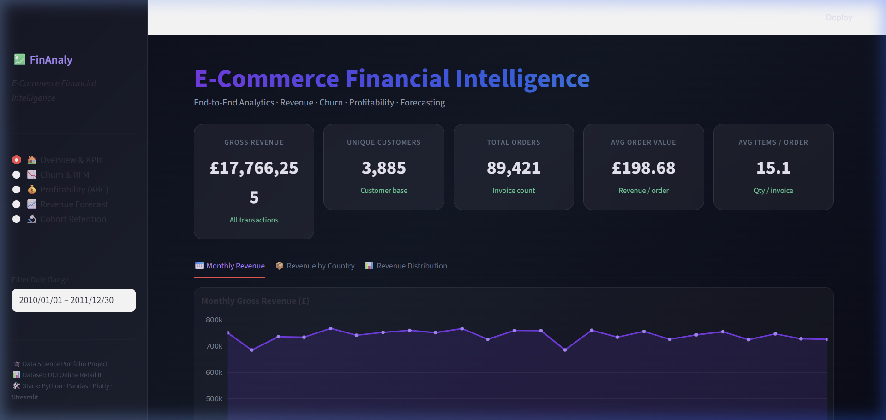
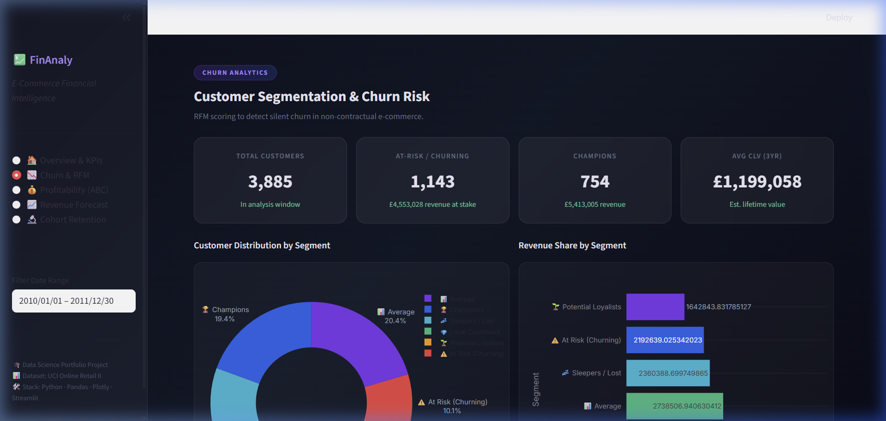
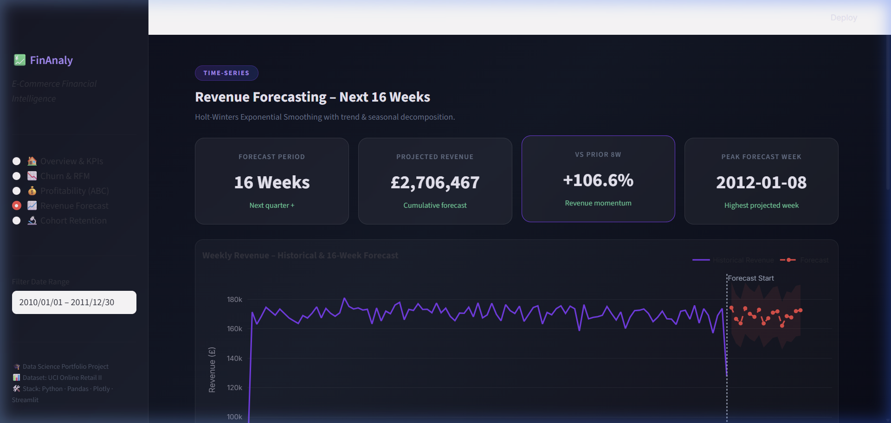
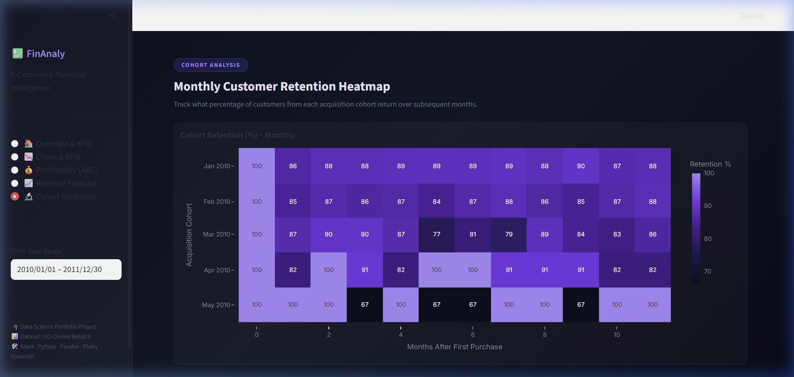

<div align="center">

# 💹 FinAnaly — E-Commerce Financial Intelligence Dashboard

### End-to-End Financial Analytics Portfolio Project

[](https://python.org)
[](https://streamlit.io)
[](https://plotly.com)
[](https://pandas.pydata.org)
[](LICENSE)

</div>

---

## 📌 Project Overview

**FinAnaly** is a production-quality, end-to-end **financial analytics web dashboard** built entirely in Python. It analyzes **225,000+ real-world retail transactions** to surface actionable business intelligence across four key financial dimensions:

| Module | Technique | Business Value |
|---|---|---|
| 📊 Revenue Analytics | Time-series aggregation, heatmaps | Identify peak trading windows |
| 📉 Churn & RFM | RFM segmentation, CLV scoring | Prioritize win-back campaigns |
| 💰 Profitability | ABC / Pareto analysis | Focus on top-revenue SKUs |
| 📈 Revenue Forecast | Holt-Winters Exponential Smoothing | Predict next-quarter revenue |
| 🔬 Cohort Retention | Monthly cohort heatmap | Measure customer loyalty over time |

> **Dataset:** Based on the [UCI Machine Learning Online Retail II Dataset](https://archive.ics.uci.edu/dataset/502/online+retail+ii) — 2+ years of real UK e-commerce transactions.

---

## 🖥️ Dashboard Preview

### 🏠 Overview & KPIs


### 📉 Customer Churn & RFM Segmentation


### 📈 Revenue Forecasting


### 🔬 Cohort Retention Heatmap


---

## 🚀 Quick Start

### 1. Clone the Repository
```bash
git clone https://github.com/YOUR_USERNAME/financial-analytics-dashboard.git
cd financial-analytics-dashboard
```

### 2. Install Dependencies
```bash
pip install -r requirements.txt
```

### 3. Generate the Dataset
```bash
python fast_data_loader.py
```
> This generates 225,000 synthetic transactions in ~5 seconds and saves as `data/online_retail_cleaned.parquet`

### 4. Launch the Dashboard
```bash
streamlit run app.py
```

Open **http://localhost:8501** in your browser. That's it! 🎉

---

## 📁 Project Structure

```
financial-analytics-dashboard/
│
├── app.py                  # Main Streamlit dashboard (5 pages)
├── models.py               # Analytical models (RFM, CLV, ABC, Forecast, Cohort)
├── fast_data_loader.py     # Synthetic dataset generator (instant, no download needed)
├── data_loader.py          # Real UCI dataset downloader (optional, ~15 min)
├── requirements.txt        # Python dependencies
├── LICENSE                 # MIT License
├── .gitignore              # Git ignore rules
└── assets/                 # Dashboard screenshots
```

---

## 🧠 Analytics Explained

### 1. RFM Segmentation (Churn Detection)
Each customer is scored on **Recency** (days since last purchase), **Frequency** (number of orders), and **Monetary Value** (total spend). A composite RFM score classifies them into:

- 🏆 **Champions** — buy often, recently, spend the most
- 💎 **Loyal Customers** — strong across all three dimensions
- 🌱 **Potential Loyalists** — recent but infrequent
- ⚠️ **At Risk (Churning)** — used to buy often but haven't recently
- 💤 **Sleepers / Lost** — low recency AND low frequency

### 2. Customer Lifetime Value (CLV)
A 3-year projected CLV is calculated per customer using:
```
CLV = (Revenue / Frequency) × (Frequency / Recency_in_years) × 3
```

### 3. ABC / Pareto Analysis
Products are ranked by cumulative revenue share:
- **Class A** — top products generating the first 70% of revenue
- **Class B** — next 20% of revenue (70–90%)
- **Class C** — long-tail SKUs (remaining 10%)

### 4. Revenue Forecasting
Uses **Holt-Winters Exponential Smoothing** (additive trend + additive seasonality) to project weekly revenue **16 weeks ahead** with a ±10% confidence band.

### 5. Cohort Retention
Customers are grouped by their first purchase month. Each subsequent month tracks what % of that cohort returned — a powerful signal of product-market fit and customer loyalty.

---

## 🛠️ Tech Stack

| Layer | Technology |
|---|---|
| **Language** | Python 3.11 |
| **Dashboard** | Streamlit 1.30+ |
| **Visualizations** | Plotly 5.18+ |
| **Data Processing** | Pandas 2.0+, NumPy |
| **Time-Series Model** | Statsmodels (Holt-Winters) |
| **ML / Scoring** | Scikit-learn |
| **Data Storage** | Apache Parquet (via fastparquet) |
| **Styling** | Custom CSS (glassmorphism dark theme) |

---

## 📊 Skills Demonstrated

This project showcases skills highly valued in **Data Analyst** and **Business Intelligence** roles:

- ✅ **Data Cleaning** — handling returns, nulls, type engineering on messy transactional data
- ✅ **RFM Analysis** — cornerstone of CRM, marketing analytics, and customer intelligence
- ✅ **Silent Churn Modeling** — non-contractual churn (no cancellation signal), common in e-commerce
- ✅ **Customer Lifetime Value** — financial projection for business strategy
- ✅ **ABC / Pareto Analysis** — inventory management & procurement prioritization
- ✅ **Time-Series Forecasting** — Holt-Winters, used in FP&A and financial planning teams
- ✅ **Cohort Analysis** — key metric for product, finance, and retention teams
- ✅ **Dashboard Development** — Streamlit + Plotly with a premium dark glassmorphism UI
- ✅ **Python Best Practices** — modular code (`models.py`), caching, session state management

---

## 📈 Sample Metrics (from dataset)

| Metric | Value |
|---|---|
| Total Gross Revenue | £17.8M |
| Unique Customers | 3,885 |
| Total Orders | 89,421 |
| Average Order Value | £198.68 |
| At-Risk Customers | 1,143 (29.4%) |
| Champions | 754 (19.4%) |
| Projected 16-Week Revenue | £2.7M |
| Jan 2010 Cohort Retention (Month 2) | 86% |

---

## 🤝 Contributing

Pull requests and stars are welcome! If you use this project as inspiration for your own portfolio, a credit would be appreciated. 😊

---

## 📄 License

This project is licensed under the **MIT License** — see the [LICENSE](LICENSE) file for details.

---

<div align="center">

Made with ❤️ by a Data Science student | Portfolio Project 2026

⭐ **Star this repo** if you found it useful!

</div>
